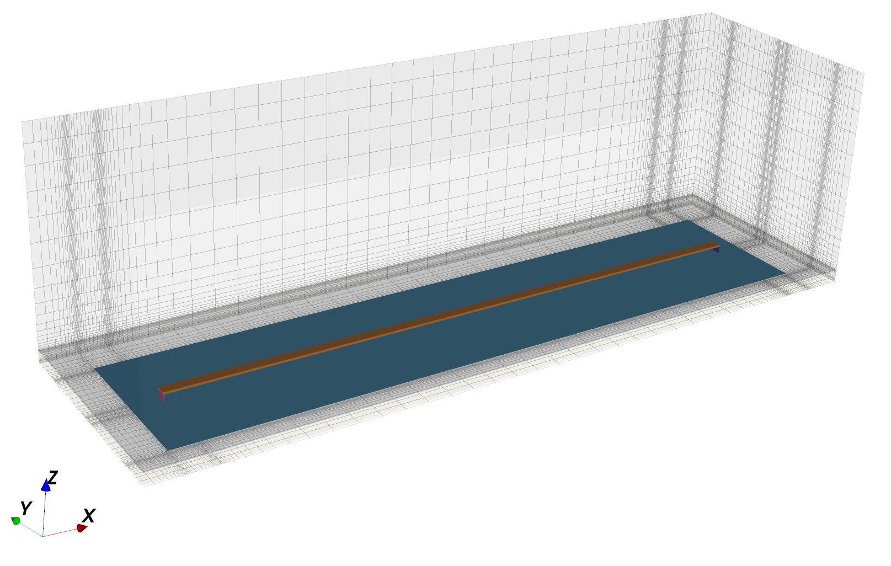
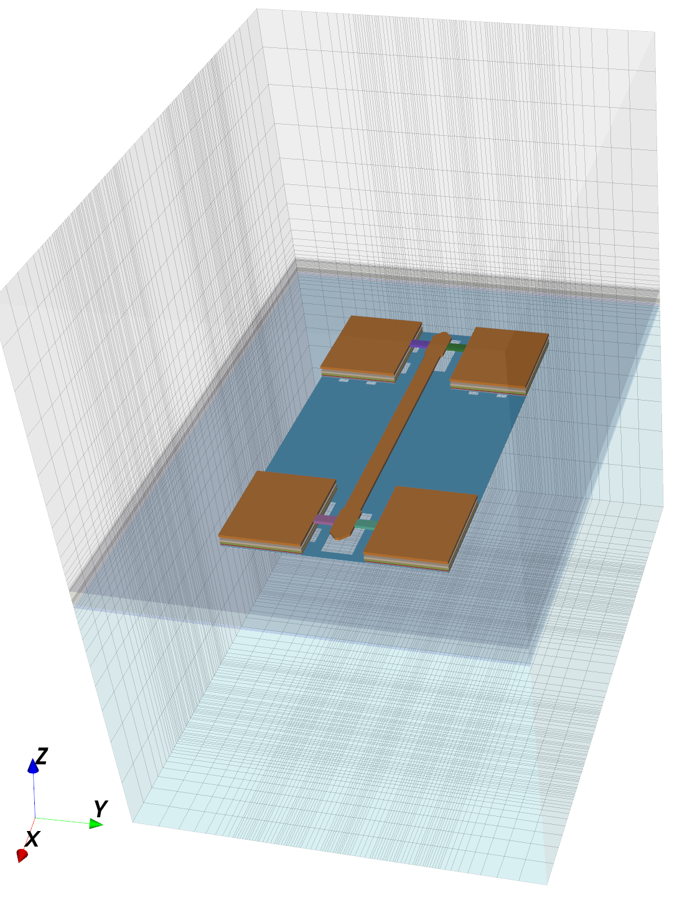
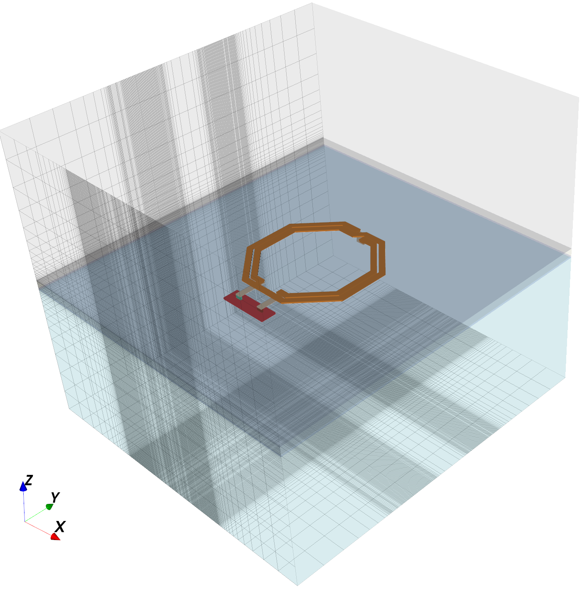
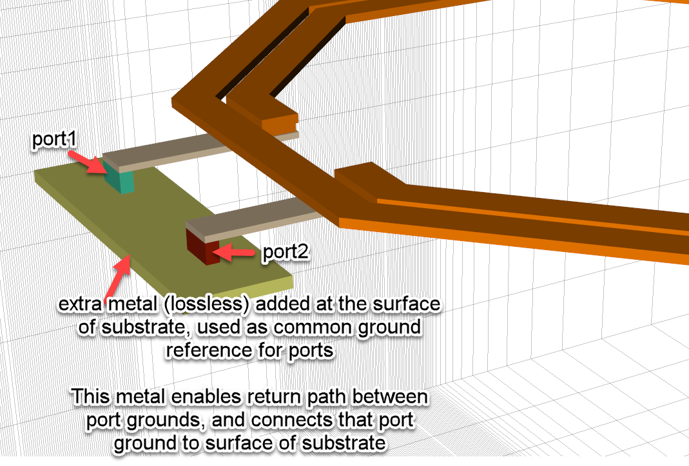

# New Python workflow for openEMS with IHP SG13G2

The files provided here enable openEMS EM simulation with layouts
created for the IHP SG13G2 RFIC technology.

The difference to the workflow available at 
https://github.com/IHP-GmbH/IHP-Open-PDK/tree/main/ihp-sg13g2/libs.tech/openems
is that we now have an additional layer of abstraction, to simplify the
re-use of model code and enable this new functionality:
- Automatic mesh generation
- The model code can load files directly from GDSII
- Ports (in-plane or via port) are defined in GDSII file on special layers
- The technology stackup is read from an XML file
- Merging of via arrays is supported
- Touchstone SnP file output is supported

Overall, models in this new workflow looks much cleaner because most "routine" stuff 
is moved into external libraries.

# Documentation
An extensive documentation is available in PDF format here:
[Using OpenEMS Python with IHP SG13G2 v2](./doc/Using_OpenEMS_Python_with_IHP_SG13G2_v2.pdf) 

# System requirements
This workflow is based on the Python workflow for OpenEMS, 
please refer to https://www.openems.de/ 
and https://docs.openems.de/python/install.html#python-linux-install 

If you have trouble to build OpenEMS for Linux, please check out the OpenEMS forum
https://github.com/thliebig/openEMS-Project/discussions 
Running the Windows version is easier because pre-built binaries are available.

In addition to OpenEMS, the Python module gdspy must be installed.

# Automatic meshing
Two meshing methods are available in this workflow. The default is equal mesh spacing across the entire area where GDSII elements are drawn. As an option, an automatic meshing algorithm will be used, which tries to detect edges and diagonal areas that need local refinement. Mesh lines that are too close (resulting in slow simulation) will be removed or merged automatically.

# Minimum configuration
The screenshot below shows a minimum configuration, which consists of the XML technology stackup, the GDSII layout, one simulation model file (here named run_inductor_diffport.py)  and the utility modules with all the “behind the scenes” code that you don’t need to modify.

# Examples
For all models, the output directory contains the *.XML file for preview in the AppCSXCAD viewer. You can use this to inspect the model and preview the mesh that is generated by this model code.

## run_line_viaport
This model simulates a simple thru line, with via ports on both ends. Excitation is only from one side, the reverse path is "faked" for S2P export assuming symmetry. The EM stackup does not include the lossy substrate, because that is shielded by the ground layer anyway. 

Note that the Metal1 ground plane is modelledand meshed explicitely. It is not recommended to use the bottom PEC boundary for this, because that is a lossless boundary and the Metal5 resistance would not show up in results.

## run_line_GSG
This model simulates a thru line with GSG pads on both ends. To properly simulate this, we use a composite port from two in-plane openEMS ports, one to each side ground pad. To drive the center conductor in-phase between these two ports, one is defined with opposite polarity. Both ports are in parallel, so each of then is defined with 2x the normal impedance.

The resulting S-parameters for each GSG port are calculated in the evaluation code section, combining the data from the "sub-ports" into one effective GSG result.

## run_line_GSG_complex
Much like the previous GSG example, but with a more complex real world layout. In the model code, layout pre-processing is enable to properly handle the cutouts in polygons. Without that pre-processing, openEMS polygons would not create the proper shape, due to self-intersecting polygons.

## run_inductor_diffport
This model simulates an octagon inductor. There is only one differential port, placed between the inductor terminals. Results are valid for differential model of operation, and the code plots differential L and Q as well as numerical value for series L and series R at one extraction frequency. That extraction frequency is defined in the evaluation code section.

## run_inductor_2port
This is the 2-port simulation of the same inductor as mentioned above. Here, two via ports are created down to an artifical common ground reference placed at the surface of the silicon. This ground polygon was added manually in the GDSII file, just like the port polygons.

The resulting S-parameters can be used for simulation, or you can extract a narrowband lumped element pi model using the [pi-from-s2p tool](https://github.com/VolkerMuehlhaus/pi_from_s2p) 

## run_dual_dipole
This is an example for antenna simulation, based on a design by IHP authors Klaus Schmalz et al: 
K. Schmalz, W. Ruoyu, J. Borngräber, W. Debski, W. Winkler , and C.Meliani, “245 GHz SiGe transmitter with integrated antenna and external PLL,” in IEEE IMS, 2013, pp. 1–3

An additional layer of air is added all around the drawn layout, and PML_8 absorbing boundaries are defined instead of the PEC metal box walls in most other models. To enable antenna pattern calculation, a NF2FF field sampling box is added to the model. The data evaluation code demonstrates various details of antenna pattern calculation as well as radiation efficiency etc.

## run_rfcmim_2port_full
This is an example for MIM capacitor modelling, demonstrating features like via array merging.
The ultra thin MIM dielectric in the stackup is replaced by a thicker dielectric with larger permittivity, resulting in the same area capacitance. This is to prevent an ultra-small time step in simulation that would be required to resolve the ultra-thin MIM dielectric, slowing down simulation.

## run_transformer_diffport
This model shows the 2 port-port simulation of a simple transformer with mixed impedance, to show how mixed impedances can be handled in S-parameter plotting. Of course, you could also simulate using 50 Ohm ports everywhere and then create 50 Ohm S-parameters, if that data block is to be used elsewhere in simulation. The results will be perfectly valid with 50 Ohm ports, no matter what the DUT impedance is.

